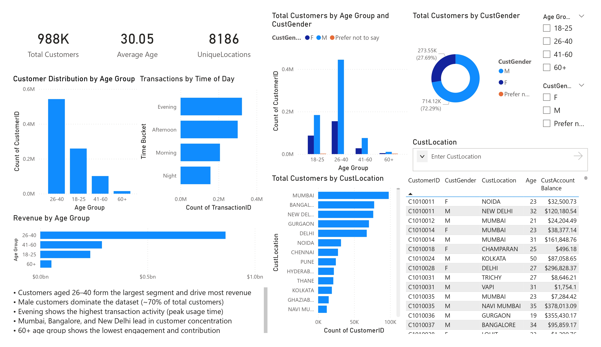

# 🏦 Bank Customer Segmentation Dashboard | Power BI

Power BI dashboard analyzing bank customer behavior, transaction patterns, 
and customer segmentation across 988K customers.

## Dashboard Preview

## Project Overview
Analyzed a large-scale bank transactions dataset to segment customers, 
identify revenue drivers, and uncover behavioral patterns using Power BI 
with interactive filters and multi-page reporting.

## Dataset Information
- 988K total customers
- ₹1.44bn total transaction revenue
- 8,186 unique locations across India
- Transaction data covering Aug–Oct 2016

## Dashboard Pages
- **Page 1 — Customer Overview:** Age distribution, gender split, 
  location analysis, revenue by age group
- **Page 2 — Transaction Analysis:** Revenue trends, transaction volume, 
  time-based patterns, average transaction by age group
- **Page 3 — Customer Segmentation:** New vs Regular vs Loyal customers, 
  revenue and transaction breakdown by segment
- **Page 4 — Key Insights & Recommendations:** Business summary and 
  actionable recommendations

## Key Insights
- 👥 988K customers across 8,186 unique locations
- 💰 ₹1.44bn total revenue with ₹1.45K average transaction value
- 📊 Age group 26–40 is the largest segment driving the most revenue
- 🌆 Mumbai, Bangalore and New Delhi lead in customer concentration
- 🕐 Evening is the peak transaction period
- 🆕 84.6% of customers are New — loyalty gap identified
- 👨 Male customers dominate at 72.29% of total base

## Business Recommendations
- Focus marketing on 26–40 age group for higher ROI
- Introduce loyalty programs to convert new customers into regulars
- Target evening hours for promotions and campaigns
- Expand services in high-performing cities

## Tools & Skills Used
- Microsoft Power BI
- Data Modeling
- DAX Measures
- Customer Segmentation
- Multi-page Dashboard Design
- Interactive Filters & Slicers
- Business Intelligence Reporting

## Project Outcome
This project demonstrates skills in Power BI dashboard development, 
customer segmentation analysis, DAX calculations, and translating 
data into actionable business recommendations.
